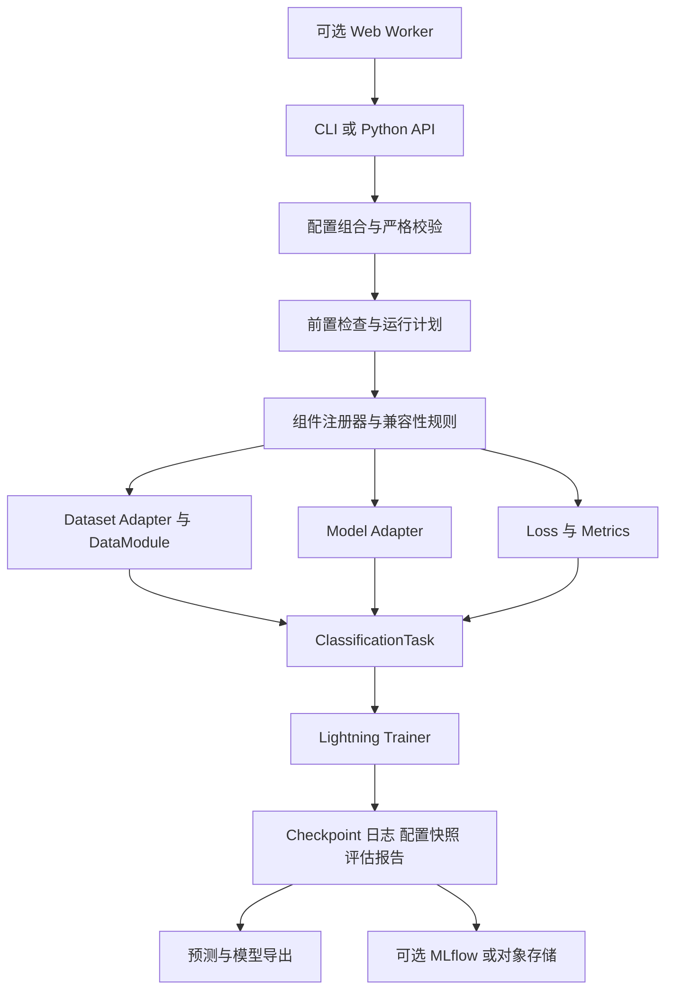

# PyTorch 通用图像分类框架：GitHub 调研与落地方案

调研日期：2026-09-28  
文档状态：**方案评审稿，等待确认后实施**  
已确认约束：**图像分类优先；使用 PyTorch；通过配置文件选择组件并一键训练。**  
本轮交付：开源项目调研、选型依据、架构、配置协议、开发阶段和验收标准。未安装训练环境、未运行训练、未修改现有业务项目。

建议阅读顺序：先看第 1、4、5 节了解选型，再看第 10 节配置体验，最后看第 15、16、18 节的排期、验收与确认项。第 6–14 节可作为实施设计依据。

## 1. 建议结论

建议建设一个独立、可安装的 **PyTorch 图像分类 Python 包 + CLI**，采用以下组合：

> PyTorch + timm + torchvision + Lightning + Hydra/OmegaConf + Pydantic + TorchMetrics。

其中 PyTorch 负责模型和计算；timm 提供主模型库；torchvision 提供基础数据集、变换和补充模型；Lightning 管理训练过程；Hydra/OmegaConf 组合配置；Pydantic 负责严格校验；TorchMetrics 负责指标。前期本地保存实验文件，可选 TensorBoard；需要接入现有平台时增加 MLflow 适配器。

**核心自研内容集中在配置、数据协议、兼容性约束、实验产物和扩展接口，不重新实现主流网络，也不从零实现分布式训练引擎。**

按当前需求排序：

1. **长期推荐：组件组合的轻量框架。** 适合逐步扩展模型、数据集和损失，形成自己的稳定配置协议，并接入已有 Web 平台。
2. **快速成型备选：基于 MMPreTrain 扩展。** 如果更看重现有分类配方、研究算法和 OpenMMLab 生态，且可接受其配置与依赖体系，这条路线可减少首期开发。
3. **最快验证基线：直接使用 timm 训练脚本。** 可用于确认模型和数据有效性，但不等于已具备完整的数据注册、配置约束、标准产物和平台接口。

这里的“通用”应定义为：**在清晰的任务和数据协议下可扩展，已验证的组合可以只改配置运行。** 不承诺任何模型、任何数据集、任何损失都能任意组合。

以上为本项目的工程选型判断，不是性能跑分结论。模型与训练底座能力依据：[timm](https://github.com/huggingface/pytorch-image-models)、[torchvision 数据集](https://docs.pytorch.org/vision/stable/datasets.html)、[Lightning](https://github.com/Lightning-AI/pytorch-lightning)、[MMPreTrain](https://github.com/open-mmlab/mmpretrain)。

## 2. 范围与产品形态

### 2.1 首期目标

用户准备一份 YAML 后，应能完成：

```text
选择配方 → 检查环境与数据 → 获取/定位权重和数据 → 训练与验证
        → 保存最优模型 → 独立测试 → 单图/批量预测 → 可选导出
```

“一键训练”包含配置解析、前置检查和训练启动，不意味着自动取得受限制的数据集，也不意味着自动找到最优超参数。首次下载受网络影响，失败应给出可执行的重试或离线导入指引。

| 范围 | v0.1 可用版 | v1.0 稳定版 | 后续可选 |
|---|---|---|---|
| 任务 | 单标签多分类；二分类按两类多分类处理 | 增加多标签分类、单 logit 二分类 | 层级分类、开放集、检索、蒸馏 |
| 模型 | 4 个代表模型 + timm 通用适配器 | 8 个认证模型配置 + 自定义模型接口 | Hugging Face 视觉编码器、专用领域模型 |
| 数据 | CIFAR-10/100、MNIST、FashionMNIST；ImageFolder、CSV | 增加 Pets、Flowers102；JSONL、多标签 manifest | ImageNet 本地接入、HF Datasets、WebDataset |
| 损失 | CE、加权 CE、标签平滑 | Soft-target CE、BCEWithLogits、明确区分的 Focal 变体 | ASL、蒸馏损失、度量学习损失 |
| 运行 | CPU 冒烟、单 GPU、AMP、保存与恢复 | 单机多 GPU DDP、离线缓存、实验比较 | 多机、超参搜索、资源调度 |
| 入口 | CLI + Python API | 同一配置协议用于平台适配 | 可视化配置表单、任务面板 |
| 模态 | 图像 | 图像 | 文本、音频、时序作为独立任务插件 |

**本次不把 Web 前端、数据库、Kubernetes、多租户平台列为核心框架的必选依赖。** 后续需要时，训练包可以成为现有平台的执行后端。

### 2.2 用户体验建议

提供“基础配方”和“完整配置”两种层次：新用户选择模型、数据和训练轮数；高级用户再配置采样器、增强、优化器、调度器与回调。每次运行都落盘一份完全展开的配置，避免隐藏默认值。

下文的 `cls` 命令、目录及配置字段均为**拟定接口**，当前尚未实现。正式包名和命令名在实施启动时确定。

## 3. 调研方法与证据边界

本轮查看了 GitHub 官方仓库、训练代码、配置说明、发布页及官方文档。优先比较与本项目直接相关的工程能力，未以 Star 数作为选型依据，未实际安装或运行各候选框架。

需要区分三种表述：

- **已核实事实**：官方仓库、源码或文档中可直接确认的能力。
- **适配成本判断**：根据本项目目标推导的工程判断，不代表上游不具备扩展能力。
- **待实测事项**：现代 PyTorch/CUDA 兼容性、Windows 安装、训练性能、恢复精度和导出兼容性。

GitHub REST API 本轮返回 `403 rate limit exceeded`。因此没有把最新提交日期、未归档状态、issue 响应速度或 Star 数写成已核实结论。发布页与 PyPI 的已见信息另行记录；网页抓取结果可能存在缓存，实施时仍需复核。

### 3.1 发布与依赖信号

| 项目 | 本轮直接观察到的证据 | 对选型的意义 |
|---|---|---|
| timm | 发布页列出 v1.0.30，说明标注 2026-09-22 | 存在近期版本演进；适合优先做模型底座，但仍需锁版本验证。[发布页](https://github.com/huggingface/pytorch-image-models/releases) |
| Lightning | 发布页列出 2.6.6，并包含 checkpoint 加载相关修复 | P0 评估该版本或届时更新的稳定修订，不直接沿用旧模板的依赖锁定。[发布页](https://github.com/Lightning-AI/pytorch-lightning/releases) |
| MMPreTrain | PyPI JSON 返回 1.2.0，当前版本文件上传时间为 2024-01-04；GitHub Releases 首项则显示 v1.0.1 | 不同发布入口有差异，不能据此断言“停止维护”；需要核对 tag、包和主分支。[PyPI](https://pypi.org/project/mmpretrain/) / [Releases](https://github.com/open-mmlab/mmpretrain/releases) |
| MMPreTrain 依赖 | 主分支 mminstall 文件含 `mmcv>=2.0.0,<2.4.0`、`mmengine>=0.8.3,<1.0.0` | 需验证完整版本组合，不能仅确认 torch 可安装便认定环境可用。[依赖文件](https://github.com/open-mmlab/mmpretrain/blob/main/requirements/mminstall.txt) |
| SuperGradients | 发布页显示 3.7.1；仓库有自身训练配方与依赖约束 | 不根据 README 新闻区日期判断维护状态；若进入最终候选，应额外验证目标环境。[发布页](https://github.com/Deci-AI/super-gradients/releases) / [依赖文件](https://github.com/Deci-AI/super-gradients/blob/master/requirements.txt) |
| lightning-hydra-template | README 自述为社区模板，并指出部分工作流限制 | 借鉴组织方式，不直接把模板当成生产框架承诺。[仓库说明](https://github.com/ashleve/lightning-hydra-template) |

版本信息是调研快照，**不是已经验证通过的安装清单**。P0 需要产出真实的 Python/torch/torchvision/CUDA/Lightning/timm 兼容性锁定结果。

## 4. GitHub 同类项目对比

### 4.1 总览

“原生/现成”表示有官方入口或配方，不代表满足本项目全部功能；“需封装”表示可通过扩展实现。以下不足均相对于本项目需求。

| 项目 | 类型及框架 | 模型与数据能力 | 配置与训练 | 对本项目的不足 | 建议角色 |
|---|---|---|---|---|---|
| [MMPreTrain](https://github.com/open-mmlab/mmpretrain) | PyTorch 完整工具箱 | 多种分类骨干、预训练方法、数据集与自定义数据管线 | 配置继承、注册器、训练/测试入口 | 要接受 MMEngine/MMCV 体系；简洁业务 YAML、统一运行产物仍要封装；新环境需验证 | 最强直接扩展备选 |
| [timm](https://github.com/huggingface/pytorch-image-models) | PyTorch 模型与训练组件库 | 模型/权重、增强、优化器等覆盖广，也有数据加载器 | 自带 train/validate 脚本与 YAML 参数支持 | 与业务数据目录、任务协议、实验契约仍有距离；不能把所有可列举模型视为已验收 | 推荐模型底座 |
| [torchvision](https://github.com/pytorch/vision) | PyTorch 官方视觉库 | 常用网络、权重、数据集、图像变换 | 提供分类参考训练脚本 | 不是完整配置产品；仍需自定义数据协议、组件注册与任务管理 | 推荐数据与基础模型底座 |
| [Lightning](https://github.com/Lightning-AI/pytorch-lightning) | PyTorch 训练抽象 | 接入任意遵循约定的 PyTorch 模型/DataLoader | 训练器、设备策略、日志与 checkpoint 等 | 不提供本项目所需的成套分类模型/数据目录；需自行构建分类任务模块 | 推荐训练引擎 |
| [lightning-hydra-template](https://github.com/ashleve/lightning-hydra-template) | Lightning + Hydra 项目模板 | MNIST 示例，可扩展数据和模块 | 配置分组、实验覆盖、批量运行 | 是起步模板；没有完整分类产品层；README 提示 Hydra multirun/HPO 恢复限制 | 借鉴目录与实验组织 |
| [SuperGradients](https://github.com/Deci-AI/super-gradients) | PyTorch 视觉训练库 | 分类、检测、分割，模型与训练配方 | YAML recipes、单命令训练、扩展组件 | 覆盖任务多于当前需求；依赖/注册机制及权重使用条件需逐项验证 | 配方和训练策略参考 |
| [fastai](https://github.com/fastai/fastai) | PyTorch 高层训练库 | DataBlock、Learner、视觉迁移学习等 | Python API 高效，可加外部配置层 | 核心体验以 Python 为主；统一配置 schema 和产物协议需另做 | 快速实验和微调参考 |
| [Transformers + Datasets](https://github.com/huggingface/transformers) | PyTorch 路径可用的模型/数据生态 | 视觉 Transformer、Hub 模型与数据 | 官方图像分类教程、Trainer、处理器 | 针对全套经典 CNN 和任意损失的统一体验还需适配；Hub 数据不是统一标签语义 | 后续模型/数据提供方 |
| [Ludwig](https://github.com/ludwig-ai/ludwig) | 声明式深度学习框架，PyTorch 路线 | 图像、文本、结构化特征等组合 | YAML 驱动训练 | 以特征编码器/组合器抽象为主；覆盖纯图像细粒度训练配方时需学习其体系 | 多模态阶段再评估 |
| [AutoGluon](https://github.com/autogluon/autogluon) | AutoML；MultiModal 可做图像任务 | 自动化训练与多模态能力 | Predictor/API、预设和超参配置 | 更偏自动获取可用模型；逐组件显式编排和算法插件不是当前产品中心 | 自动基线工具备选 |
| [PaddleClas](https://github.com/PaddlePaddle/PaddleClas) | PaddlePaddle 分类/识别工具箱 | 分类、识别、蒸馏、行业案例 | 配置训练与部署链路 | **不符合已确定的 PyTorch 技术栈** | 仅借鉴功能设计 |

### 4.2 MMPreTrain：最接近完整成品，但需要接受其生态

已核实：模型、数据管线和训练任务围绕配置与注册器组织，官方有自定义目录数据集微调说明，损失模块包含多种分类相关实现。可直接在现有模型与数据配置上扩展。[自定义数据微调](https://github.com/open-mmlab/mmpretrain/blob/main/docs/en/notes/finetune_custom_dataset.md) / [损失模块](https://github.com/open-mmlab/mmpretrain/blob/main/mmpretrain/models/losses/__init__.py)

工程判断：如果团队熟悉 OpenMMLab，直接扩展的首期成本可能最低；如果目标是长期维护一个接口精简、能嵌入平台的通用训练包，则需要为它再做业务配置层。不能把“Python 配置可编程”直接等同于“普通用户安全易用的配置表单”。

采用它的前置验证应是：在目标机器完成自定义数据训练、恢复和预测，锁定依赖，再评估改造量。不能只根据功能表淘汰，也不建议未验证就深度 fork。

### 4.3 timm：适合做模型底座，不能误认为没有训练能力

已核实：timm 既有模型工厂，也有训练/验证脚本和 YAML 配置入口；可用模型名、预训练选项与类别数构造分类模型。其 Quickstart 同时说明，自定义微调工作流可以通过训练循环或改造脚本实现。[模型入口](https://huggingface.co/docs/timm/quickstart) / [训练脚本](https://github.com/huggingface/pytorch-image-models/blob/main/train.py)

工程判断：使用 timm 公共 API 作为依赖，能持续获得模型库更新；如果直接复制整个训练脚本并不断修改，后续同步上游会变难。因此主方案复用模型、预处理配置与选定损失/增强，训练生命周期只交给 Lightning，避免并存两套引擎。

### 4.4 Lightning + Hydra：补足工程结构，需要自己的分类协议

Lightning 解决训练生命周期，Hydra 解决配置组合，两者并不会自动解决类别映射、数据泄漏和标签与损失的匹配。模板可以借鉴，但应由自己的 schema 校验器和 registry 构建组件，不把任意 `_target_` 暴露为普通配置入口。[模板](https://github.com/ashleve/lightning-hydra-template) / [Hydra 对象实例化说明](https://hydra.cc/docs/advanced/instantiate_objects/overview/)

模板中关于 multirun 恢复的限制不能扩大解释为 Lightning 无法恢复单次训练。我们需分别设计“单个训练断点恢复”和“多次实验任务恢复”。

### 4.5 其他项目的实际价值

SuperGradients 的 YAML 配方拆分、fastai 的迁移学习体验、Transformers 的处理器与模型绑定方式，均值得参考。官方 Transformers 图像分类流程展示了图像处理器、数据变换和 Trainer 的配合，但这不等于自动适配所有 PyTorch 模型。[SuperGradients](https://github.com/Deci-AI/super-gradients) / [fastai](https://github.com/fastai/fastai) / [Transformers 图像分类](https://huggingface.co/docs/transformers/tasks/image_classification)

Ludwig 和 AutoGluon 更适合未来需要自动化或多模态的阶段。当前无需把多个完整训练框架都装进同一个进程：**主框架只保留一个训练引擎，其他生态通过模型/数据适配器接入。**

## 5. 三条落地路线的取舍

| 维度 | A：扩展 MMPreTrain | B：PyTorch + timm + Lightning，自有统一协议 | C：原生 PyTorch 全部自研 |
|---|---|---|---|
| 最早演示 | 快，前提是依赖安装顺利 | 中，需要先建立配置和任务层 | 小演示快，完整版本慢 |
| 已有研究配方 | 强 | 需挑选并整理 | 需自行整理 |
| 配置产品化 | 要包一层简化配置 | 可直接按用户场景设计 | 完全可控 |
| 模型扩充 | 遵循 OpenMMLab 模块规范 | 优先 timm，特殊模型用 Adapter | 要自建或引入模型工厂 |
| 自定义数据协议 | 扩展现有数据管线 | 自己定义稳定契约 | 自己定义稳定契约 |
| AMP/DDP/恢复 | 引擎已有能力，仍需集成验证 | 复用 Lightning，仍需契约测试 | 必须维护更多底层细节 |
| 接入现有 Web 平台 | 封装配置转换和 Runner | CLI/事件文件即稳定边界 | 可以，但维护成本高 |
| 长期负担 | 上游版本约束 + 自己的适配层 | 多组件兼容测试 + 自有协议 | 全部训练设施责任 |
| 本项目建议 | 保留备选 | **首选** | 不作为默认路线 |

推荐 B 的理由是本项目要求“广泛集成 + 自定义 + 长期复用”，而不只是跑一次训练。B 并非依赖最少，但能将工作集中到最有价值的领域约束。

**切换条件：** P0 验证如果表明现成 MMPreTrain 配方已覆盖大部分确定需求，且目标环境可稳定运行、团队愿意使用其配置体系，可重新选择 A。若用户坚持只使用原生 torch、排除 Lightning，再选择 C，并增加分布式和恢复的开发预算。

## 6. 推荐架构



### 6.1 模块职责

| 模块 | 负责内容 | 不应承担的内容 |
|---|---|---|
| Config | YAML 合并、默认值、类型、schema 迁移、最终快照 | 实例化任意用户 Python 对象 |
| Registry | 组件发现、构建、能力声明和版本信息 | 巨大的模型/数据 `if/elif` 分支 |
| DatasetAdapter | 数据读取、类别语义、split、数据指纹 | GPU 调度、模型层替换 |
| ModelAdapter | 权重加载、分类头、输入约束、标准 logits 输出 | 自己创建训练循环 |
| Task | 分类任务语义、loss、预测解码、指标更新 | 数据下载、Web 业务逻辑 |
| Engine | fit/validate/test/predict，精度、DDP、恢复 | 决定业务类别和数据切分 |
| Artifact | 运行目录、checkpoint、bundle、报告和事件 | 默默重写已有实验 |
| Integration | MLflow、对象存储、平台事件映射 | 改变核心训练语义 |

### 6.2 关键协议

**样本协议**：至少包含 `sample_id`、`image`、`target`；可选 `group_id`、`path`、`metadata`。每个数据适配器声明任务类型、类别数、类别映射、标签类型、split 和数据版本。

**模型协议**：以 Tensor 图像为输入，标准结果包含 `logits`；可选 `features`、`aux_logits`。普通 CE/BCE 只消费 logits；需要辅助输出的损失必须明确声明。对 tuple/dict 输出使用专门适配器，不能一律取第一个元素。

**损失协议**：声明支持 `hard_class_index`、`soft_class_distribution`、`multi_hot` 中的哪些 target 类型，以及是否需要特征、辅助头或教师模型。新损失必须携带 schema 和有限值/梯度验证。

**插件协议**：模型、数据、损失、指标、变换、优化器、调度器、回调均可注册。新数据读取器本质上仍需要一次 Python 开发；接入后用户才可仅改 YAML。插件通过明确启用的安装包注册，配置文件本身不携带待执行代码。

### 6.3 核心能力清单与安装边界

核心依赖包括 torch、torchvision、timm、Lightning、TorchMetrics、Hydra/OmegaConf、Pydantic、CLI 库、Pillow 和 NumPy。选择的准确版本由 P0 决定。

可选扩展拆开安装：`tracking`（MLflow/TensorBoard）、`hf`（Datasets/Hub）、`export`（ONNX/ONNX Runtime）、`hpo`（Optuna）。基础训练无需数据库或在线服务；不用某项能力就不加载其依赖。

首期不同时引入另一套配置生成器或另一个 Trainer。Hydra 仅承担配置组合，Pydantic 承担字段和语义校验，CLI 只负责命令分发，职责保持明确。

## 7. 模型集成与预训练策略

### 7.1 两级模型目录

| 级别 | 定义 | 用户界面/CLI 表现 |
|---|---|---|
| 认证模型 | 固定 provider/name/weights，已完成预设训练、恢复、预测测试；导出单独标状态 | 默认展示，提供推荐配方 |
| 扩展模型 | 上游模型库可发现，尚未通过本项目完整验证 | 标注 experimental，运行前必须做形状和 loss 检查 |

模型能力表至少记录：输入通道、默认分辨率、尺寸约束、权重来源、归一化参数、输出类型、分类头策略、冻结策略、已验证任务、导出状态和许可证信息。

不把多个权重版本计为多个独立算法，也不以模型列表数量作为验收标准。

### 7.2 建议认证的 8 个配置

| 阶段 | 网络配置 | 用途 |
|---|---|---|
| v0.1 | ResNet18、ResNet50、MobileNetV3-Small、EfficientNet-B0 | 基线、较强 CNN、轻量推理和效率比较 |
| v1.0 | ConvNeXt-Tiny、ViT-Tiny/16、DeiT-Tiny/16、Swin-Tiny | 覆盖现代 CNN、全局注意力、蒸馏模型族和窗口注意力 |

上述为模型族/架构名称；具体 timm 名称和预训练 tag 需要在锁定版本下解析并记录。后四项首选普通分类输出配置，带蒸馏辅助头的变体另列实验能力。

torchvision 适配器作为补充与官方基线，不为每个同名模型重复维护两份认证配方。至少验证一个 torchvision 模型，以确保第二提供方接口真实可用。

### 7.3 权重与预处理必须绑定

- 预训练微调默认使用权重配套的输入尺寸、插值、归一化和验证裁剪策略；训练增强可以覆盖，但覆盖结果必须显式保存。
- 从零训练按数据与配方设置预处理，不能因为模型名字相同而套用未选择的权重配置。
- 灰度数据允许显式选择转 3 通道，或使用经过验证的单通道适配；不静默更改网络输入层。
- 分类头通过 provider 支持的接口替换；自定义模型由适配器处理，不假设所有模型都叫 `.fc`。
- 权重缺失时失败并指示下载/缓存位置，不静默切换到随机初始化。
- 首次解析 provider 默认权重后，记录明确 tag/revision/hash，后续重现使用该身份，避免 `DEFAULT` 随版本变化。

小分辨率数据需要单独说明：将 CIFAR 的 32×32 图像放大到预训练输入尺寸，可以作为迁移学习实验；若使用 CIFAR 专用 stem 从零训练，应给出另一个配方。两者的准确率、速度和论文基线不能直接混为一谈。torchvision 官方配方也展示了不同网络、权重需要不同预处理和训练设置。[参考配方](https://github.com/pytorch/vision/blob/main/references/classification/README.md)

冻结训练支持 `full_finetune`、`linear_probe`，阶段式解冻后续再加；冻结 backbone 时还必须明确 BatchNorm 统计与 Dropout 的模式，不能只设置 `requires_grad=False`。

## 8. 数据集接入与自定义格式

### 8.1 开源数据集目录

“集成数据集”是提供适配器、标签映射、准备方法与固定切分规则，不是将所有原始数据打包进项目。公开可下载也不等于任意用途的授权已经解决；目录需记录原始来源与使用条件。

| 数据集/来源 | 接入方式 | 切分规则 | 阶段 |
|---|---|---|---|
| MNIST、FashionMNIST | torchvision adapter；灰度处理显式配置 | 仅从官方 train 中划分 val；官方 test 保留 | v0.1 |
| CIFAR-10、CIFAR-100 | torchvision adapter | 同上，固定分层切分与 seed | v0.1 |
| Oxford-IIIT Pet | torchvision 分类标签 | 从官方 trainval 中划分 val；官方 test 保留 | v1.0 |
| Flowers102 | torchvision adapter | 默认沿用官方 train/val/test；不自动合并 | v1.0 |
| ImageNet-1K | 用户准备文件后，本地校验与索引 | 明确官方 val 的使用角色；无独立测试时标记 test unavailable | 后续按实际数据接入 |
| Hugging Face Datasets | 可选 provider，固定 repo/config/revision | 显式配置 image/label 列及 split 映射 | 后续 |
| 大规模分片数据 | WebDataset 或其他流式 adapter | 定义分片分配、每轮样本数和 worker/rank 去重 | 后续 |

官方依据：[torchvision 数据集目录](https://docs.pytorch.org/vision/stable/datasets.html)、[Pets](https://docs.pytorch.org/vision/stable/generated/torchvision.datasets.OxfordIIITPet.html)、[Flowers102](https://docs.pytorch.org/vision/stable/generated/torchvision.datasets.Flowers102.html)、[ImageNet](https://docs.pytorch.org/vision/stable/generated/torchvision.datasets.ImageNet.html)、[HF 图像数据加载](https://huggingface.co/docs/datasets/image_load)。HF Datasets 是分发与加载工具，仍需要自己的 schema 适配与标签核验。

### 8.2 自定义格式一：ImageFolder

适合单标签分类，建议目录：

```text
my_dataset/
  classes.json
  train/
    cat/001.jpg
    dog/002.jpg
  val/
    cat/101.jpg
    dog/102.jpg
  test/                 # 可选；不存在时不伪造 test 指标
    cat/201.jpg
    dog/202.jpg
```

`classes.json` 保存固定顺序，例如 `{"cat": 0, "dog": 1}`。优先使用显式类别表，否则只根据训练集生成并冻结；val/test 必须使用相同映射，不能各自扫描目录重新编号。验证集缺某个已知类应记录为缺失，出现未知类则报错。

若只有原始目录且无 split，执行一次数据准备命令生成不可变 manifest，再启动训练；每次训练不重复随机切分。

### 8.3 自定义格式二：CSV/JSONL manifest

单标签 CSV：

```csv
sample_id,path,label,split,group_id
img_001,images/001.jpg,cat,train,animal_001
img_002,images/002.jpg,dog,val,animal_002
img_003,images/003.jpg,cat,test,animal_003
```

多标签优先 JSONL，避免 CSV 中数组编码歧义：

```json
{"sample_id":"img_004","path":"images/004.jpg","labels":["cat","indoor"],"split":"train","group_id":"scene_001"}
{"sample_id":"img_005","path":"images/005.jpg","labels":[],"split":"val","group_id":"scene_002"}
```

空标签数组只有在“所有类都已经标注、确实均为阴性”的闭集多标签任务中才合法，不能把缺失标注当成阴性。存在部分标注时，需要额外 mask 协议和适配损失，首期应拒绝混入。

manifest 路径按 `dataset.root` 解释；配置文件中的其他相对路径按根配置文件所在目录解析，不能随 Hydra 工作目录变化。目录形式和 manifest 形式最终都转换为同一个内部数据索引。

### 8.4 数据准备必须完成的检查

1. 检查文件可读、图片可解码、尺寸与通道有效；损坏文件输出明确列表。
2. 检查 sample_id 唯一、标签合法、类别数一致、split 非空。
3. 检查训练/验证/测试之间的路径、样本 ID 和内容哈希重复。
4. 连拍、视频帧、同一对象多视图等数据按 group 切分；存在时间依赖时按时间切分。
5. 保存类别分布和缺失类别报告；小类样本不足时不强行声称切分已分层。
6. 多标签使用显式 split 或后续验证的多标签分层算法，不能直接复用单标签分层逻辑。
7. 统计归一化、类别权重和采样权重只使用训练集。
8. 输出 manifest、classes、split 清单及 fingerprint，训练使用准备结果。

默认遇到坏数据失败；若用户选择剔除，生成新数据版本与剔除报告。DDP 运行中不允许每个 rank 自行跳过不同样本。

内容全量哈希是强校验；大数据可以先用文件大小/mtime 的快速检查，但要明确它不是内容一致性证明。数据版本应记录校验级别。精确哈希不能发现所有近重复图像，近重复检测可作为后续可选检查。

### 8.5 下载、缓存与离线

数据目录只下载用户选择的项目；共享缓存使用下载锁、临时文件、校验和与原子替换。为每个 provider 提供离线导入和缓存路径配置。

多 GPU 时仅由指定主进程下载，完成后同步；训练进程不同时解压同一目录。`offline: true` 时禁止依赖网络获取必需资源，缺失即在训练前报告。Hugging Face 来源需要固定 revision；需要权限的数据集由用户预先准备。

## 9. 损失、增强和指标的兼容性

### 9.1 任务与损失的约定

| 任务/策略 | logits | target | 损失 | 解码/核心指标 |
|---|---|---|---|---|
| 单标签多分类 | `[N,C]` | `[N]` int64 类别索引 | CrossEntropyLoss | softmax/argmax；Top-1、Macro-F1 |
| 二分类默认模式 | `[N,2]` | `[N]`，取值 0/1 | CrossEntropyLoss | 正类概率明确对应 classes 映射 |
| 二分类单 logit 模式 | `[N,1]` | `[N,1]` float | BCEWithLogitsLoss | sigmoid；阈值、PR-AUC/ROC-AUC/F1 |
| 多标签分类 | `[N,C]` | `[N,C]` float multi-hot | BCEWithLogitsLoss | 每类 sigmoid；mAP、Micro/Macro-F1 |
| 单标签 Mixup/CutMix | `[N,C]` | `[N,C]` 概率分布 | Soft-target CE | 验证仍用原始 hard label |

PyTorch CE 可接受类别索引或合法类别概率，BCEWithLogits 则包含稳定的 sigmoid 与 BCE 运算。因此训练头输出 logits，不能在模型内先做 softmax/sigmoid 再传入这两个损失。[PyTorch 损失源码与说明](https://github.com/pytorch/pytorch/blob/main/torch/nn/modules/loss.py)

### 9.2 实现优先级

| 阶段 | 损失与策略 | 工程注意事项 |
|---|---|---|
| v0.1 | CE、class_weight、label_smoothing | 标签平滑只应用一次；权重从训练集计算并落盘 |
| v1.0 | BCEWithLogits、Soft-target CE、softmax focal、sigmoid focal | 两种 focal 分开命名和定义 alpha/gamma；混合精度下检查数值 |
| 后续 | Asymmetric Loss、蒸馏 KL、ArcFace/CosFace、SupCon | 需要额外任务结构、教师/特征/采样器，不能当普通 CE 的任意替换项 |

**损失函数多并不必然提高准确率。** 先跑 CE/BCE 基线，根据类别失衡、标签性质与验证结果选择更复杂的损失。Dice 等分割导向损失不列为首期普通分类能力。

蒸馏应定义为独立训练策略，管理 teacher、温度、特征与权重，例如 CE 与带温度修正的 KL 组合，而不是仅在 `loss.name` 中填一个名字。v1.0 不承诺任意组合损失。

### 9.3 配置阶段应拒绝的组合

- `multilabel + cross_entropy(hard index)`。
- 未支持软标签的 focal 实现与 Mixup/CutMix 同时启用。
- 在基础 v1.0 中将单标签版 Mixup 直接用于多标签任务。
- 模型分类头输出类别数与 classes 映射不一致。
- 固定尺寸模型与不兼容的输入尺寸；不支持的单通道预训练适配。
- Mixup 已平滑标签，损失又重复平滑。
- 度量损失需要 embedding 或成对采样，当前 task 却只提供普通 logits。
- 同时启用重采样与类别加权却没有显式选择策略；默认提示并要求配置明确，而不是静默叠加补偿。

### 9.4 增强策略

先提供可解释的预设：`baseline`（基础裁剪/翻转）、`finetune`（保守微调）、`strong`（RandAugment/RandomErasing 等）。不同数据类型允许关闭翻转、颜色扰动和随机裁剪，例如方向敏感或颜色决定类别的数据。

只对训练集使用随机增强；val/test/predict 共用确定的评估预处理。Mixup/CutMix 在 batch 层应用，普通增强在 sample 层应用，避免两处重复。

### 9.5 评估口径

- 单标签默认报告 Top-1、Macro-F1、逐类 precision/recall/F1 和混淆矩阵；仅 `C>=5` 时报告 Top-5。
- Macro-F1 固定 class 集合，说明零支持类和零分母策略；同时输出每类 support。
- 多标签报告 mAP、Micro-F1、Macro-F1；不使用含义模糊的“accuracy”。若额外报告完全匹配率，明确它要求整组标签一致。
- AUC/AP 遇到缺少正类或负类的情况按指标定义处理，记录 undefined/排除情况与参与聚合的类数，不随意填 0。
- 阈值只在验证集选择；需要精细阈值优化时从开发数据保留 calibration 子集。测试集不参与模型、阈值或增强选择。
- 混合标签训练中的准确率不能直接当普通 hard-label accuracy；可禁用该训练指标或明确其定义，最终对比以确定的验证指标为准。
- DDP 的 F1/AUC 不能简单平均每卡数值；正确同步计数/预测。评估 sampler 可能为对齐补齐重复样本，需要按 sample_id 去重或使用无重复方案。

框架默认每轮只运行 validation。只有显式执行 `test` 才读取锁定的测试集；超参搜索不批量查看测试成绩。建议同时报告相同切分、相同训练预算下多随机种子的均值与标准差。

## 10. 配置与命令设计

### 10.1 配置组织

```text
configs/
  base.yaml
  task/                  # multiclass、binary、multilabel
  model/                 # provider + name + weights + head
  dataset/               # provider + 数据来源 + split 规则
  augmentation/          # baseline、finetune、strong
  loss/
  optimizer/
  scheduler/
  runtime/               # cpu_smoke、single_gpu、ddp
  experiment/            # 已认证、可重复的完整配方
```

拟定覆盖优先级：内置 base → 组件/实验预设 → 用户 YAML → CLI `--set`。导出最终值和关键覆盖来源。配置须包含 `schema_version`，未知字段默认报错；例如 `learning_rage` 不应被默默忽略。

### 10.2 一份完整配置示例

下例是**拟议 schema**，表示本地自定义单标签数据微调；不是已经存在的可执行脚本。数值是起步配置，不是准确率保证或针对所有数据集的最优超参。

```yaml
schema_version: 1
experiment:
  name: custom_resnet18
  seed: 42
  output_root: ./runs

task:
  type: multiclass

dataset:
  provider: imagefolder
  root: ./data/my_dataset
  classes_file: ./data/my_dataset/classes.json
  splits:
    train: train
    val: val
    test: test
  download: false
  num_classes: auto
  integrity: strict

model:
  provider: timm
  name: resnet18
  weights:
    source: provider_default
    required: true
  input_channels: 3
  num_classes: auto
  training_mode: full_finetune

preprocessing:
  source: model_weights
  image_size: auto
  color_mode: RGB

augmentation:
  preset: finetune
  mixup_alpha: 0.0
  cutmix_alpha: 0.0

loader:
  batch_size_per_device: 32
  num_workers: 4
  pin_memory: auto
  persistent_workers: auto

loss:
  name: cross_entropy
  label_smoothing: 0.0
  class_weight: null

optimizer:
  name: adamw
  lr: 0.0003
  weight_decay: 0.01
  exclude_norm_and_bias_from_decay: true

scheduler:
  name: warmup_cosine
  interval: step
  warmup_epochs: 2
  min_lr: 0.000001

trainer:
  engine: lightning
  accelerator: auto
  devices: 1
  precision: auto
  max_epochs: 30
  accumulate_grad_batches: 1
  gradient_clip_val: 1.0
  deterministic: false

evaluation:
  metrics: [accuracy_top1, macro_f1, per_class, confusion_matrix]
  monitor: val/macro_f1
  mode: max
  test_after_fit: false

checkpoint:
  save_best: true
  save_last: true
  every_n_epochs: 1
  resume_from: null
  resume_policy: strict

logging:
  jsonl: true
  tensorboard: false
  mlflow:
    enabled: false

runtime:
  offline: false
  cache_dir: ./cache
```

`auto` 必须在训练前全部解析，并保存到 `config.resolved.yaml`：类别数来自固定 classes；预处理来自所选权重；精度按硬件探测确定（支持的 GPU 可用 bf16，否则选择经过验证的 fp16 或 fp32，CPU 默认 fp32）。显式配置 GPU 却无 GPU 时直接报错；只有 `accelerator: auto` 才允许记录后选择 CPU。

`num_workers=0` 时自动关闭 persistent workers；Windows 提供覆盖为 0 的冒烟配方。所有自动选择都在日志与快照中可见。

### 10.3 更换数据集或任务

CIFAR 配方使用该数据集的适配器与切分规则，而非保留 ImageFolder 字段：

```yaml
dataset:
  provider: torchvision
  name: cifar10
  root: ./data
  download: true
  num_classes: auto
  split_policy:
    mode: official_test_train_holdout
    val_fraction: 0.1
    stratify: true
    seed: 42
```

多标签切换是一组相关字段的变更，应提供完整预设，不能只替换 loss：

```yaml
task:
  type: multilabel
dataset:
  provider: manifest
  root: ./data/tags
  manifest: ./data/tags/samples.jsonl
  classes_file: ./data/tags/classes.json
  target_field: labels
  split_field: split
loss:
  name: bce_with_logits
  pos_weight: null
evaluation:
  metrics: [map, micro_f1, macro_f1, per_class]
  threshold: 0.5
  monitor: val/map
  mode: max
  test_after_fit: false
```

上述片段用于替换相应配置组；不会将上一个 provider 的无关字段合并保留。CLI 需明确支持“选择配置组”和“覆盖标量”两种操作。

### 10.4 拟定 CLI

```powershell
# 查看本版本经过验证的目录及能力
cls list models --certified
cls list datasets
cls list losses

# 从配方生成用户配置
cls init --recipe cifar10_resnet18 --output experiment.yaml

# 无副作用检查；不自动下载、不自动修改数据
cls doctor -c experiment.yaml

# 显式准备所选数据和权重，生成可复用 manifest/缓存
cls prepare -c experiment.yaml

# 一键训练；缺少资源时按配置决定是否准备，随后做 preflight
cls train -c experiment.yaml

# 最小真实运行；执行几个训练/验证 batch，并写入独立 smoke 目录
cls smoke -c experiment.yaml --set trainer.max_epochs=1 --set scheduler.warmup_epochs=0

# 恢复同一实验；类别、数据版本、优化器等必须兼容
cls train -c experiment.yaml --resume ./runs/run_001/checkpoints/last.ckpt

# 独立测试和预测，从 bundle 读取类别映射与预处理
cls test --bundle ./runs/run_001/bundle -c experiment.yaml --split test
cls predict --bundle ./runs/run_001/bundle --input ./images --output predictions.jsonl

# 针对认证模型的导出；生成后进行数值对齐验证
cls export --bundle ./runs/run_001/bundle --format onnx
```

`doctor` 检查静态配置、资源可见性和已准备数据元信息；`smoke` 才执行真实前向/反向。`train` 的 preflight 包含小批量维度、标签和 loss 检查，然后启动完整训练。不得用假数据通过的 smoke 代替真实数据链路验收。

独立 `test` 从配置定位测试数据，类别表、模型和预处理以 bundle 为准并核对兼容性；不能用新配置静默覆盖已训练模型的类别语义。数据目录跨机器变化时允许显式重定位并复核数据指纹。

高级实验批处理可以后续增加 `cls sweep`。即使内部使用 Hydra，也不把未经持久化的 multirun 当作可恢复任务队列。

### 10.5 常见错误提示示例

```text
E_TASK_LOSS: task=multilabel 不支持 cross_entropy 的 hard-label 配方。
建议选择 multilabel_bce 预设；当前标签字段为 labels，类别数为 8。

E_CLASS_MAP: val 中出现训练类别表未定义的类别 rabbit。
位置：data/my_dataset/val/rabbit/001.jpg。

E_PRETRAINED_MISSING: 已要求使用预训练权重，但离线缓存未命中。
需要的 provider/tag/hash 与预期缓存路径已写入 prepare_report.json。
```

## 11. 训练、恢复与实验产物

### 11.1 训练运行约束

首期支持 CPU 与单 GPU，稳定版验证单机 DDP。梯度累积后的名义有效 batch 为：

```text
每设备 batch × 设备数 × 梯度累积步数
```

末尾不完整 batch 的实际样本数单独考虑。切换设备数不静默缩放学习率；若配方启用缩放，必须记录规则与最终值。warmup/cosine 按真实 optimizer update 计步，考虑累积与每轮 batch 数。

避免多层并发：训练内部的 DDP 与外部任务队列是两件事。单机阶段默认一张 GPU 同时执行一个训练作业；吞吐通过 batch 和 DataLoader 优化，而不是默认给同一 GPU 堆多个 Celery 训练任务。

### 11.2 恢复分成三种语义

| 模式 | 恢复哪些内容 | 使用场景 |
|---|---|---|
| `resume` | 模型、优化器、调度器、AMP scaler（适用时）、epoch/step、回调状态、随机状态与采样状态 | 中断后继续同一实验 |
| `finetune_from` | 兼容模型权重；新建优化器、调度器、run_id | 在新数据或新训练策略上微调 |
| `predict` | 选定权重、类别映射、评估预处理、阈值 | 推理和评估 |

仅保存 `state_dict` 不足以恢复训练。Lightning 的 checkpoint 机制作为基础，项目还需显式保存数据指纹、类别映射、配方版本及经过验证的随机/采样状态，不假设引擎替我们记录所有业务信息。

v1.0 **承诺 epoch 边界恢复**，中断最多损失上一个已保存边界后的工作。多 worker 预取、随机增强、流式数据的任意 batch 精确恢复不列为首期承诺。若后续需要，应额外保存可重放的采样器与数据迭代状态并专项验证。

严格恢复核对 schema、代码/依赖版本、类别映射、数据指纹、模型形状、优化器和调度器；更改学习率日程、有效 batch 或 world size 视为显式 fork/迁移，不声称完全等价恢复。

随机种子只是一部分：保存 Python/NumPy/torch CPU/CUDA 随机状态及数据 worker 的播种规则。可提供确定性模式，但不承诺跨硬件、跨库版本逐位相同。

### 11.3 标准输出

```text
runs/<run_id>/
  config.original.yaml
  config.resolved.yaml
  environment.json
  provenance.json              # 代码版本、模型/权重来源、依赖锁文件摘要
  dataset_manifest.jsonl
  dataset_fingerprint.json
  classes.json
  preprocess.json
  metrics.jsonl
  events.jsonl
  status.json
  checkpoints/
    last.ckpt
    best.ckpt
  evaluation/
    val_metrics.json
    test_metrics.json          # 仅显式测试后出现
    per_class.csv
    confusion_matrix.png
    predictions.jsonl
  bundle/
    model.safetensors          # 或明确限定格式的 state_dict
    model_spec.json
    classes.json
    preprocess.json
    thresholds.json            # 适用时
    bundle_manifest.json
```

推理 bundle 使用验证选定的 best 权重，记录其 checkpoint 身份。离线载入时不再下载预训练权重，模型先按结构构建，再加载 bundle 中已训练的权重。

checkpoint 与 bundle 分离：前者用于恢复，后者用于可移植推理。若存在不适配 safetensors 的模型状态，明确记录格式与加载限制，不悄悄丢失 buffer。模型参数和代码接口仍需版本对应。

配置快照应去掉访问凭据，凭据仅通过环境/凭据系统注入。普通配置只引用已注册组件；第三方 Python 插件属于代码安装，需要单独审核与版本管理。Hydra 官方明确说明对象实例化能力可调用代码，因此本项目的用户配置入口不直接开放任意 `_target_`。[Hydra 官方说明](https://hydra.cc/docs/advanced/instantiate_objects/overview/)

### 11.4 状态与事件

核心状态建议为 `PREPARING → RUNNING → SUCCEEDED`，异常为 `FAILED`，取消为 `CANCELLED`，正在停止可加 `STOPPING`。事件记录 `run_id`、时间、阶段、epoch、step、指标和错误码。

仅主 rank 写运行产物，checkpoint 原子写入。接到可处理的停止信号时在安全边界保存；强制杀进程或断电不能保证最后一次保存，因此依赖已有持久化 checkpoint。

网络下载失败可做有限重试；无效配置、形状错误、NaN 和 OOM 不应无条件重跑相同参数。自动降低 batch 会改变实验条件，若允许此能力应生成新 run 并记录变更。

### 11.5 导出

v1.0 只对选定认证模型验证 ONNX：先固定输入尺寸、验证 batch=1 与一个较大 batch，再决定是否支持动态维度。对比同一图像经相同预处理的 PyTorch 与 ONNX 输出，保存误差与 Top-1 对齐结果。

不能只以“生成了 onnx 文件”作为成功，也不能承诺 timm 全部模型可导出。预处理与阈值必须随导出产物发布；TensorRT、量化和跨硬件部署作为后续任务。

## 12. 建议项目结构与扩展方式

建议作为独立仓库/包开发，目录暂拟 `E:\xhh\projects\pytorch-classification-framework`。本轮未创建该项目；具体位置在方案确认后确定。

```text
pytorch-classification-framework/
  pyproject.toml
  uv.lock                         # 或团队选定的等价锁定文件
  README.md
  configs/
  src/clsframework/
    cli/
    config/                       # schema、解析、迁移、覆盖来源
    registry/
    contracts/                    # 样本、模型结果、任务和能力定义
    data/
      adapters/                   # torchvision、imagefolder、manifest
      prepare.py
      splits.py
      integrity.py
      datamodule.py
    models/
      adapters/                   # timm、torchvision、custom
      catalog.py
    losses/
    metrics/
    transforms/
    tasks/
      classification.py
    engine/
      runner.py
      checkpoints.py
      callbacks.py
    artifacts/
    inference/
    export/
    integrations/
  tests/
    contracts/
    integration/
    gpu/
    fixtures/                     # 合成图片和小型授权测试素材
  examples/
    custom_model/
    custom_dataset/
    custom_loss/
  docs/
    quickstart.md
    config-reference.md
    data-format.md
    extension-guide.md
    reproducibility.md
    compatibility-matrix.md
    troubleshooting.md
```

扩展约定：新增普通模型时增加适配器/注册描述，不修改主训练循环；新增数据集时实现数据协议、准备规则和切分测试；新增损失时声明 target 类型并增加数值/梯度测试。新增一种需要多个网络或特殊 batch 的算法时，允许增加 Task/Strategy，避免把所有研究方法塞进同一个万能 loss 接口。

训练任务的 Python API 拟定为 `train(config) -> RunResult`、`evaluate(bundle, data) -> EvalResult`、`predict(bundle, inputs)`。CLI 和 Web Worker 共用同一实现，禁止维护两套训练代码。

## 13. 与现有分类 Web MVP 的可选衔接

### 13.1 本轮已做的本地核查

现有项目位于 [deep-learning-classification-mvp](E:/xhh/projects/deep-learning-classification-mvp/README.md)。本轮只阅读 README 和训练相关源码，没有启动服务或复测历史验收结果。

| 已观察内容 | 当前位置 | 对新框架的启示 |
|---|---|---|
| Celery 任务内组织模型、数据、loss 和训练循环 | [tasks.py](E:/xhh/projects/deep-learning-classification-mvp/backend/app/tasks.py:79) | 抽离为训练包，让任务函数承担调用与状态转换 |
| 当前模型表为 ResNet18/34，数据表为 CIFAR-10/100 | [注册表](E:/xhh/projects/deep-learning-classification-mvp/backend/app/tasks.py:50) | 模型/数据目录改由核心 registry 提供，避免前后端各维护一份 |
| loss 为 CE，优化器为 Adam；预处理固定 224 和 ImageNet 归一化 | [训练实现](E:/xhh/projects/deep-learning-classification-mvp/backend/app/tasks.py:114) | 改成权重/配方绑定并允许配置 |
| 每轮读取官方 test 数据并记录 test_accuracy | [评估循环](E:/xhh/projects/deep-learning-classification-mvp/backend/app/tasks.py:155) | 新框架独立建立 val，减少持续查看 test 导致调参偏差的风险 |
| 当前产物保存 model.state_dict | [保存逻辑](E:/xhh/projects/deep-learning-classification-mvp/backend/app/tasks.py:172) | 增加完整恢复 checkpoint 和独立推理 bundle |
| 在线分类入口加载官方 ResNet18/ImageNet 分类器 | [model_service.py](E:/xhh/projects/deep-learning-classification-mvp/backend/app/model_service.py:11) | 新训练模型要通过明确 bundle 选择接入预测，不能默认认为训练后已上线 |

### 13.2 接入顺序

1. 先完成训练包 CLI 与产物协议，独立验证真实数据上的训练、测试和预测。
2. 在现有平台增加配置转换层，把旧 `model_id/dataset_id/epochs` 转换为新 schema；保留旧任务记录。
3. Worker 启动独立训练进程或容器，通过 `events.jsonl` 与状态文件同步进度；不要在 API 请求或 Celery prefork 子进程中直接嵌套一套未经验证的 DDP 启动逻辑。
4. MLflow 作为 logger/产物适配器；平台维护 `job_id`，训练包维护 `run_id`，重试另记 attempt，关系明确。
5. 成功后将 bundle 发布到模型目录，由用户选择该训练模型做推理；服务读取 bundle 的类别和预处理。
6. 最后再做前端模型/数据/损失选择表单，表单由 schema 与能力目录驱动。

GPU 使用由外层任务调度器分配，训练进程只看到分配的设备。队列重投递要有幂等处理，不能为同一 attempt 同时启动两个训练进程。既有 MinIO、MLflow 和数据库可以继续复用，但核心框架不要求它们在线。

这条接入路线是**可选追加工作**，不默认纳入首期核心框架预算，也不以本轮调研作为修改现有平台的授权。

## 14. 环境、算力与依赖方案

### 14.1 环境原则

- 开发基线可先评估 Python 3.12；准确版本取决于 P0 的兼容测试，不预先保证全部候选依赖支持同一版本。
- torch 与 torchvision 按官方兼容组合安装，CUDA wheel 与主机驱动匹配；CPU 与 GPU 环境分别验收和锁定。
- Windows 原生环境覆盖 CLI 与 CPU/单 GPU 冒烟；持续训练和 DDP 优先 Linux/WSL2。DDP 不能仅凭单 GPU 测试标记通过。
- 提供核心安装方式、可选 extras、可复现 lockfile；后续需要容器时提供固定基础镜像与 digest。
- `torch.compile`、channels-last、梯度检查点等性能功能初期默认关闭，按模型逐项验证后进入优化配方。
- 国内网络或离线环境通过可配置缓存、代理与本地导入解决；不把非官方不明镜像写死为默认下载源。

### 14.2 资源规划建议

| 场景 | 建议用途 | 资源判断 |
|---|---|---|
| CPU | 合成数据/小子集烟测、配置和恢复测试 | 不据此预估大型模型训练时长 |
| 单张 8–12 GB GPU | 小型 CNN、小 batch 的 224 微调试验 | 是规划起点，实际可用 batch 需要测量 |
| 单张 16–24 GB GPU | 更方便地验证 Transformer、多标签和多配方 | 同样受分辨率、模型和优化器状态影响 |
| 两张或更多 GPU | DDP 验收、吞吐对比 | 没有此环境时保持 DDP 未验收状态 |

以上不是硬件采购建议或显存保证。本轮未读取机器 GPU 状态，也没有基准测试。实施 P0 先测实际显存、samples/s、单 epoch 时间和数据加载占比，再决定 batch 与配方。

总训练时间估算使用实测热身后的吞吐与数据量，记录启动/验证/保存开销，不用网络参数量直接猜时长。磁盘需要同时考虑原始包、解压数据、索引缓存、模型权重和多个 checkpoint；默认保留 best/last，额外历史版本可配置。

### 14.3 代码、权重和数据的来源记录

核心候选中，timm 和 Lightning 的许可证文件为 Apache-2.0，torchvision 的许可证文件为 BSD-3-Clause；落地时按锁定版本保留原始 LICENSE/NOTICE。[timm LICENSE](https://github.com/huggingface/pytorch-image-models/blob/main/LICENSE) / [Lightning LICENSE](https://github.com/Lightning-AI/pytorch-lightning/blob/master/LICENSE) / [torchvision LICENSE](https://github.com/pytorch/vision/blob/main/LICENSE)

包的代码许可证不能替代预训练权重、训练数据或下游数据集的使用条件。模型/数据 catalog 保存来源 URL、revision、许可证/使用条件链接和确认状态；没有足够信息时标记未知，不自动宣称可商用。本节只定义工程记录要求。

## 15. 开发阶段与交付物

估算基于一名熟悉 PyTorch 的工程师、可使用一台训练机、无需开发 Web UI。是**人工工作量估算**，不包含等待数据授权、长周期训练和资源排队；不同工程经验会明显影响进度。

| 阶段 | 工作内容 | 交付/退出条件 | 估算 |
|---|---|---|---|
| P0：技术验证 | 目标环境、版本矩阵；timm + Lightning 的最小真实训练；自定义数据闭环；初步性能测量 | 一个固定配方可 train/test/predict；锁定依赖；确认路线 B 可行 | 2–3 人日 |
| P1：v0.1 | registry/schema/CLI；4 个认证模型配置；4 个基础数据集；ImageFolder/CSV；CE 系列；checkpoint；本地日志 | 修改 YAML 可替换已支持组件；真实单 GPU训练与 CPU 烟测；支持 epoch 恢复 | 8–12 人日 |
| P2：v1.0 功能 | 扩展至 8 个认证模型配置与 6 个公开数据集；多标签/JSONL/BCE/Focal/soft-label；Mixup；离线缓存；DDP | 标签与损失的正反例测试通过；代表性 DDP、恢复和离线测试通过 | 6–9 人日 |
| P3：v1.0 发布验收 | 独立评估、bundle、选定模型 ONNX、兼容性矩阵、示例与文档 | 完成验收清单；产出基准报告和已知限制 | 5–7 人日 |

核心合计约 **21–31 人日**；增加约 20% 的集成缓冲后，约 **25–37 人日，按每周 5 个工作日约 5–8 周**。首个可用 v0.1 预计需要约 2–3 周。该估算在 P0 后根据真实环境和功能选择更新。

可选追加工作独立估算：现有 Web Worker/MLflow/bundle 接入约 4–7 人日；配置表单和任务交互需要另行评估；HPO、蒸馏、多机与新模态各自立项，不暗含在上述工期中。

### 15.1 最小优先顺序

预算有限时，先完成：自定义数据 → ResNet18 预训练微调 → CE → 验证/测试隔离 → 完整 checkpoint → bundle 预测，然后扩展至 MobileNet/EfficientNet/ResNet50。没有完成这一闭环之前，不以堆叠模型名称扩大范围。

### 15.2 P0 的具体实施清单（确认后执行）

1. 确认项目目录、硬件、Python/CUDA 组合以及用于验收的真实图像样本。
2. 建立独立包和锁定环境，输出 `doctor` 的环境报告。
3. 用 ResNet18 + CIFAR-10 子集跑通真实训练，再用 ImageFolder 跑通自定义数据。
4. 保存并恢复一个 epoch 边界 checkpoint，确认优化器与调度器接续。
5. 从 bundle 单独加载，验证预测类别与预处理一致。
6. 在 P0 报告中列出实际版本、时长、显存和问题，再冻结 P1 实施范围。

此处是实施计划；**本轮没有执行上述步骤。**

## 16. 验收标准与测试策略

### 16.1 必须通过的行为验收

| 编号 | 验收事项 | 判定依据 |
|---|---|---|
| A01 | 配置替换 | 同一入口切换认证模型、数据集、CE/BCE 对应任务，无需修改主训练代码 |
| A02 | 自定义数据 | ImageFolder、CSV、JSONL 的固定样本得到相同类别映射和正确 target |
| A03 | 训练可学习 | 小型确定性样本可过拟合，loss/梯度有限；不能只证明进程无异常 |
| A04 | 数据隔离 | train/val/test 的重叠和跨 split group 被检测；切分结果持久化 |
| A05 | 无效组合 | 标签类型、输出维度和损失不匹配时训练前明确失败 |
| A06 | 可恢复 | 固定环境中，连续 2 epoch 与训练 1 epoch 后恢复到 2 epoch 的 optimizer step、LR 日程一致；CPU 确定性样例比较权重/结果 |
| A07 | GPU/AMP | 代表模型在目标 GPU 完成真实前后向与保存；NaN/Inf 可检测 |
| A08 | DDP | 两 GPU 的样本分配和全局评估结果正确，无补齐样本重复计数；中断后可按约定恢复 |
| A09 | 离线 | 缓存齐全时断网可 train/predict；缺失资源时前置报错 |
| A10 | 模型移植 | 新进程仅凭 bundle + 安装包即可预测，不依赖训练时内存对象和在线服务 |
| A11 | 导出对齐 | 至少两种选定认证模型完成 ONNX 输出误差与预测一致性检查；其他模型逐项标状态 |
| A12 | 错误与取消 | 损坏图片、缺类、OOM、停止信号有明确状态与记录，不无限重试 |
| A13 | 结果可追溯 | 所有 run 有配置、数据指纹、类别映射、权重身份、依赖版本与指标 |
| A14 | 扩展性 | 独立示例增加一个模型、数据读取器和损失，不修改通用训练循环 |

GPU 数值比较容差、ONNX 容差在 P0/导出验证时结合精度和模型固定，不能通过事后任意放宽来掩盖差异。准确率阈值来自相同数据与训练预算的基线，不能未经实验给出“所有数据集达到 95%”之类承诺。

### 16.2 避免组合爆炸的测试矩阵

- 每次核心改动：CPU 合成/固定小图数据测试配置、标签、loss、split、保存加载等契约。
- 认证模型变更：每个模型做前向/反向和 bundle 往返；代表 CNN/Transformer 在真实数据上完成短训练。
- 数据适配器变更：每种数据完成准备、标签、split、dataloader 和一个代表模型短训练。
- 稳定版发布：CNN + 单标签、Transformer + 单标签、多标签 + BCE、软标签 + CE、离线、恢复、DDP、导出等关键交叉组合。
- 周期性基准：若干固定配方完整训练，记录均值/方差、峰值显存和吞吐；不在每次提交中重新下载全部数据。

8 个认证模型与 6 个数据集表示适配与代表组合验收，不等于 48 种组合都训练到收敛。兼容性矩阵必须逐项区分 `tested`、`experimental`、`unsupported`，并记录测试版本、设备和范围。

### 16.3 推荐的首批真实配方

| 配方 | 验证目的 | 注意 |
|---|---|---|
| ResNet18 + CIFAR-10 | 全链路、恢复、基础基线 | 注明是否预训练、是否放大输入 |
| MobileNetV3 + 自定义 ImageFolder | 轻量微调和业务数据 | 按对象/来源分组，避免近重复泄漏 |
| EfficientNet-B0 + Pets | 自带 split 的适配与微调 | trainval 中再划 val，test 留到最终 |
| ViT/DeiT + Flowers102 | Transformer 头替换与预处理 | 使用官方 split，声明预训练来源 |
| ResNet18 + 多标签 manifest | BCE、阈值、mAP/F1 | 合成标签先验证契约；真实效果需真实多标签数据 |

正式报告不只展示最佳准确率，还展示不平衡数据上的 Macro-F1、逐类召回、固定硬件吞吐、显存和失败样本。数据规模不足时明确实验局限。

## 17. 主要风险与控制措施

| 风险 | 典型后果 | 方案中的控制方式 |
|---|---|---|
| 范围失控 | 模型很多但训练闭环脆弱 | 分版本交付，认证模型与实验模型分开 |
| 上游 API/版本变化 | 曾经可用的配置不能加载 | 锁依赖与权重身份，升级前跑兼容性矩阵 |
| 标签或数据切分错误 | 指标虚高、线上类别错位 | 固定 classes、group split、哈希和单独 test |
| 预处理不一致 | 训练好但预测差 | 权重、评估变换与 bundle 一起保存 |
| 把所有损失视作可互换 | loss 数值正常但任务语义错误 | target 契约、任务校验与负例测试 |
| 恢复仅加载权重 | 日程重启，结果不可比较 | 完整 checkpoint，明确 resume/finetune 区别 |
| 平台与训练耦合 | 本地无法运行，扩展成本上升 | 核心包独立，平台通过配置与事件调用 |
| 共享 GPU 并发失控 | OOM、作业互相拖慢 | 设备分配与作业隔离，默认单 GPU 单作业 |
| 上游下载不可用 | 用户无法启动 | prepare/cache/offline，保存来源与校验值 |
| 仅凭 README 判断维护状态 | 误选或错判项目 | 区分发布、源码、依赖与实测，保留证据边界 |

## 18. 方案确认项

已有明确结论：**首期图像分类，框架使用 PyTorch。**

建议本次确认以下方案包即可进入 P0：

| 待决策项 | 建议默认 |
|---|---|
| 技术路线 | 路线 B：PyTorch + timm + torchvision + Lightning |
| 第一版交付 | 独立 Python 包 + CLI + YAML + 本地实验产物 |
| 任务边界 | v0.1 单标签/两类模式；v1.0 增加多标签 |
| 开源模型与数据 | 先认证 4 个模型配置、4 个基础数据集，再扩充到 8/6 |
| 自定义数据 | 首期 ImageFolder/CSV，稳定版 JSONL 与多标签 |
| 首期高级能力 | epoch 边界恢复、明确 train/val/test；单 GPU 优先 |
| 与现有平台关系 | 独立框架验收后，可另行接入现有 Web MVP |
| 尚需实施时确定 | 目标 GPU/系统、真实业务样本、最终项目目录与包名 |

如果希望最快得到现成工具，可改选 MMPreTrain 路线；若认可以上默认，下一步先执行 P0 并以真实报告校正排期。用户确认前保持方案阶段。

## 19. 主要资料与核验记录

引用均指向项目官方仓库、源码、官方维护的文档或包分发页；访问日期为 2026-09-28。部分 main/latest 页面会变化，正式实施应补充锁定 tag/commit 的永久链接。

| 资料 | 用途 |
|---|---|
| [timm 仓库](https://github.com/huggingface/pytorch-image-models)、[训练源码](https://github.com/huggingface/pytorch-image-models/blob/main/train.py)、[Quickstart](https://huggingface.co/docs/timm/quickstart) | 模型工厂、权重、训练和配置能力 |
| [MMPreTrain 仓库](https://github.com/open-mmlab/mmpretrain)、[自定义数据微调](https://github.com/open-mmlab/mmpretrain/blob/main/docs/en/notes/finetune_custom_dataset.md)、[依赖约束](https://github.com/open-mmlab/mmpretrain/blob/main/requirements/mminstall.txt) | 完整工具箱、数据协议与环境负担 |
| [MMPreTrain PyPI](https://pypi.org/project/mmpretrain/)、[PyPI 元数据接口](https://pypi.org/pypi/mmpretrain/json) | 版本与文件上传时间核对 |
| [torchvision 数据集](https://docs.pytorch.org/vision/stable/datasets.html)、[分类参考脚本](https://github.com/pytorch/vision/blob/main/references/classification/README.md) | 基础数据集、官方配方 |
| [Lightning 仓库](https://github.com/Lightning-AI/pytorch-lightning)、[Trainer 源码](https://github.com/Lightning-AI/pytorch-lightning/blob/master/src/lightning/pytorch/trainer/trainer.py)、[发布页](https://github.com/Lightning-AI/pytorch-lightning/releases) | 训练引擎与版本检查 |
| [lightning-hydra-template](https://github.com/ashleve/lightning-hydra-template) | 模板组织与已声明限制 |
| [SuperGradients](https://github.com/Deci-AI/super-gradients)、[fastai](https://github.com/fastai/fastai) | 配方与高层训练体验比较 |
| [Transformers 图像分类](https://huggingface.co/docs/transformers/tasks/image_classification)、[Datasets 图像数据](https://huggingface.co/docs/datasets/image_load) | 模型/处理器/数据适配参考 |
| [Ludwig](https://github.com/ludwig-ai/ludwig)、[AutoGluon](https://github.com/autogluon/autogluon)、[PaddleClas](https://github.com/PaddlePaddle/PaddleClas) | 声明式、多模态、AutoML 与非 PyTorch 对照 |
| [PyTorch 损失实现](https://github.com/pytorch/pytorch/blob/main/torch/nn/modules/loss.py)、[Hydra 实例化说明](https://hydra.cc/docs/advanced/instantiate_objects/overview/) | 标签/损失契约和配置执行边界 |

辅助证据文件：[GitHub 调研快照](E:/xhh/docs/图像分类框架-GitHub调研快照-2026-09-28.json)。包含 API 限流记录与可核实的发布/源码观察，不包含训练性能数据。

**本轮验证范围：文档与源码调研、已有项目的只读核查、方案文档一致性检查。所有安装、训练、性能、DDP、恢复和导出验收均属于确认后的实施阶段。**
